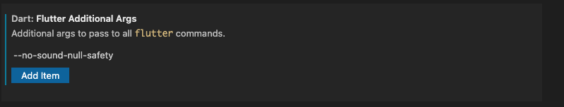

# Gifter

To build and run the project run the `build.sh` script.

> Prerequisites
> Flutter v1.22+

When I Installed Flutter I had left it on Master build, by the time I noticed Flutter 2.0 had come out into stable.

Rather than re-write a lot of the code that was dependent on dart 2.12 I opted to continue with the now stable Flutter 2.0 using Dart 2.12. 

I could not get any device tests running due to some libs not been null safe. I did make a old driver and newer Integration test, but, I was not able to disable the null check when running and they fail.

I upgraded to M1 macs and I don't have any Intel macs anymore, so I hope everything compiles OK on an Intel Mac.

## Null safe

`--no-sound-null-safety` as an additional arg is required to run an test.

# Testing

When running any `flutter test` command you must always append the `--no-sound-null-safety` otherwise the null linter will fail.

When runnings tests from VSCode (Android Studio was not tested) you must edit the extensions `Dart: Flutter Additional Args` to add the `--no-sound-null-safety`

When runnings tests from VSCode (Android Studio was not tested) you must edit the extensions `Dart: Flutter Test Additional Args` to add the `--no-sound-null-safety`


**NOTE** If you are doing this from Android Studio you will need to edit the run config to pass the `--no-sound-null-safety`

## Theming

`CupertinoTheme` is almost totally ignored for simplicity sake. So, the app looks very Android-y. 

## Setup

When opening the project run the following commands

```
flutter pub get
dart migrate --apply-changes
flutter pub run build_runner build --delete-conflicting-outputs
```

### Android

Assuming Android tools are in the system path.
```
sdkmanager --licenses | sdkmanager --update
sdkmanager build-tools;28.0.2
```

## Flutter Config

### Development Version
Flutter Version: 2.0
Dart Version: 2.12

# Libraries

* freezed - This brings something like value classes to dart.
  - Value equality
  - Copy constructor
  - Json Serialization integration
* Bloc - I used the Cubic component to move state out of the widget.
* cached_network_image - Normally this make Widget testing hard. I did find an article details how to 
make things more testable.
* lint - Is a community style guide.
* flutter_secure_storage - Was used to save the login session. The Android security implementation could be better.

# Issues

## Denomination 
The price field is sometimes encoded using a string and other times using both int and double.
The mixed encoding could be an API contract violation, or a result of differing backend APIs returning a mixed encoding. 

In this demo project all the strings are parsed into doubles. 


# Other NOTES

## Testing Cached Network Image 
One of the issues with `cachednetworkimage` is that it makes testing harder. To make it easier in testing I found this article that explains one way to subvert the cache to load the image from the test context.
https://medium.com/flutter-community/golden-testing-using-cachednetworkimage-1b488c653af3